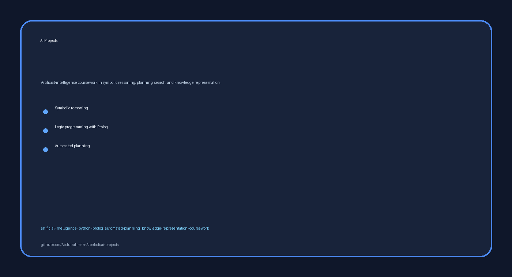

# AI Projects

<!-- employer-visual:start -->

  

<!-- employer-visual:end -->

Artificial-intelligence coursework in symbolic reasoning, planning, search, and knowledge representation.

**Technologies:** Python · Prolog · Automated Planning

## Highlights

- Logic-programming exercises for symbolic knowledge representation.
- GraphPlan-style planning work using a blocks-world domain.
- Small, inspectable projects focused on foundational AI concepts.

## Projects

| Project | Location |
|---|---|
| Prolog Knowledge Systems | [`projects/prolog-knowledge-systems`](projects/prolog-knowledge-systems) |
| GraphPlan Blocks World | [`projects/graphplan-blocks-world`](projects/graphplan-blocks-world) |

## Getting started

1. Enter the selected project directory.
2. Use a compatible Python or Prolog runtime as appropriate.
3. Review project-local source files and comments for entry points.

## Portfolio note

This repository emphasizes classical AI foundations rather than production-scale model deployment.

## License and attribution

Third-party and collaborator attribution is documented in [`THIRD_PARTY_NOTICES.md`](THIRD_PARTY_NOTICES.md).

Use and redistribution are governed by the repository's [`LICENSE`](LICENSE).
